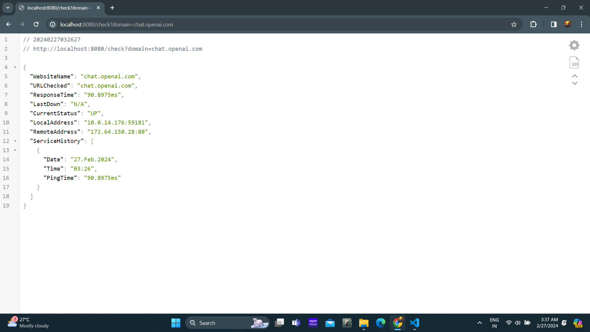
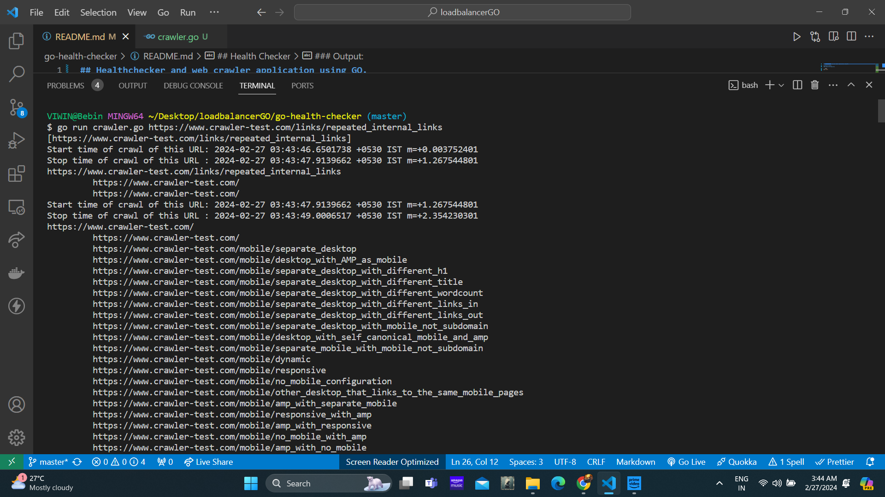

## Health Checker and Web Crawler application using GO.

## Health Checker

### Clone the repository

```bash
git clone https://github.com/viwinkumarpadala/go-web-checker-and-crawler.git
```

Change the directory:

```bash
cd go-web-checker-and-crawler
```
## Health Checker

Run the server:

```bash
go run main.go check.go
```

Making API calls:

```bash
http://localhost:8080/check?domain=chat.openai.com
```

### Output:


## Web crawler
Run the function: 

```bash
go run crawler.go https://www.crawler-test.com/links/repeated_internal_links
```

### Output:
